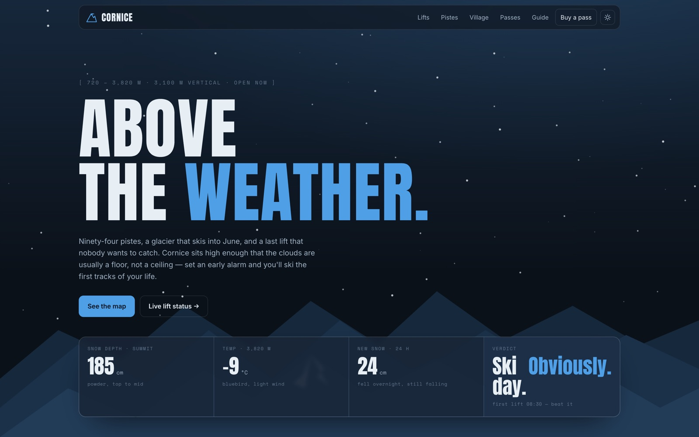

<!-- parable:beautified -->
<div align="center">

<h1>Cornice</h1>

<p><strong>Alpine ski resort — a live lift-status board + an interactive SVG piste map with difficulty filter.</strong></p>

<p>
  <a href="https://bswxyz.github.io/cornice/"></a>
  
  
  <a href="LICENSE"></a>
</p>

<p>
  <a href="https://bswxyz.github.io/cornice/"><b>Live demo</b></a>
  &nbsp;·&nbsp;
  <a href="https://bswxyz.github.io/cornice/guide/">Build notes</a>
  &nbsp;·&nbsp;
  <a href="https://parable-three.vercel.app/templates">More templates</a>
</p>

<a href="https://bswxyz.github.io/cornice/">
  
</a>

</div>

**Use this template** — copy the source into a new project:

```bash
npx degit bswxyz/cornice my-app
```


A high-alpine ski-resort site — a live lift-status board (counting wait times, pulsing status pills),
an interactive SVG piste map you can filter by grade and trace run by run, and a falling-snow canvas
that pauses when it can't be seen. Part of the
[Parable design showcase](https://parable-three.vercel.app).

---

## The concept

Cornice is a fictional high-alpine resort: 94 pistes, 3,100 vertical metres, a glacier that skis into
June. A resort site really answers two pre-coffee questions — *which lifts are turning* and *what can
I ski down* — so those two became the signature: a board that reads like the one at the base station,
wired to a map you can actually poke. Voice is crisp, alpine and a little proud: "Above the weather."
"Ski day. Obviously."

## Design system

- **Palette — dark is alpine night, light is glacier day.** Tokens flip on `:root[data-theme]`:
  night `#0e1620` ↔ glacier `#eef3f6`, a piste-blue accent (`#2f7fd0`, lightened to `#4f9fe6` for
  night), a black-run red `#d64545` for warnings, and constant piste-grade colours (green / blue /
  red / black) that read the same in both themes. A layered ridgeline + snow sit in a fixed backdrop.
- **Type:** `Anton` (tall condensed display — resort-signage energy) · `Inter` (body) ·
  `Space Mono` (the numbers a mountain runs on — altitudes, wait times, temperatures).
- **Signature technique:** a **live lift-status board** wired to an **interactive SVG piste map**.
  Wait times count up on scroll; status pills pulse; each run is an SVG path linked to a list row so
  hovering or focusing either lights up its twin and updates a readout; a grade filter fades the
  rest. Named ease `cubic-bezier(.22,.78,.28,1)` — a schuss gliding to a stop.
- **Voice:** crisp, alpine, proud. "One mountain, four ways in."

## Stack

- **Plain HTML / CSS / vanilla JS. No framework, no build step, no bundler, no CDN** — the falling
  snow is a hand-rolled 2D canvas and every mountain, run and icon is inline SVG, so the page has
  zero runtime dependencies.
- **Inline SVG** for the piste map, layered ridge silhouettes, lift/amenity icons and the brand mark.
- Reveals, the animated counters, the linked map/board interactions and the demo pass picker are
  native `IntersectionObserver` + `requestAnimationFrame` + event listeners.

## Running it locally

No install — all paths are relative:

```bash
git clone https://github.com/bswxyz/cornice
cd cornice
python3 -m http.server 8000      # or: npx serve .
# open http://localhost:8000
```

## Structure

```
index.html          the page (semantic sections; .js gate for progressive enhancement)
styles.css          all styling — design tokens (both themes) live in :root at the top
main.js             snow canvas, theme toggle, reveals, counters, lift board, piste map, demo picker
guide/index.html    the "how it was built" write-up (self-contained, styled to match)
.nojekyll           tells GitHub Pages to serve files as-is
```

## Demo vs. real — what a production version would need

An intentionally-scoped demo. What's **fictional/mocked** today:

- **The resort, lifts, runs and conditions are fictional.** Names, altitudes, wait times, snow depth,
  temperatures and avalanche risk are invented; the lift board is static markup with client-side
  counters, not a live feed. A real board needs a data source (the resort's lift-control system or a
  feed like Lumiplan / Skidata) polled on an interval, plus a "last updated" timestamp from the feed.
- **The piste map is illustrative.** The mountain and runs are hand-drawn SVG, not surveyed geometry.
  A real map would render actual piste GeoJSON (and probably a proper base map / 3D terrain).
- **The lift passes don't sell anything.** "Choose 6-day" validates the interaction and confirms
  in-place but charges nothing and issues no pass. A real version needs a checkout (Stripe / a resort
  ticketing provider), date selection, age verification for the free-ski tiers, and an order record.
- **No accounts, no analytics, no CMS.** Copy, prices and products are hand-edited HTML.

What's **real** and reusable as-is: the falling-snow canvas (with its DPR cap, IntersectionObserver +
visibility pause and reduced-motion still-frame), the scroll-triggered counters, the linked
board ↔ map hover/focus/filter interaction model, the full light/dark theming, and the whole
responsive / reduced-motion / keyboard layer.

## License

[MIT](LICENSE). Design & build by **Parable**.
